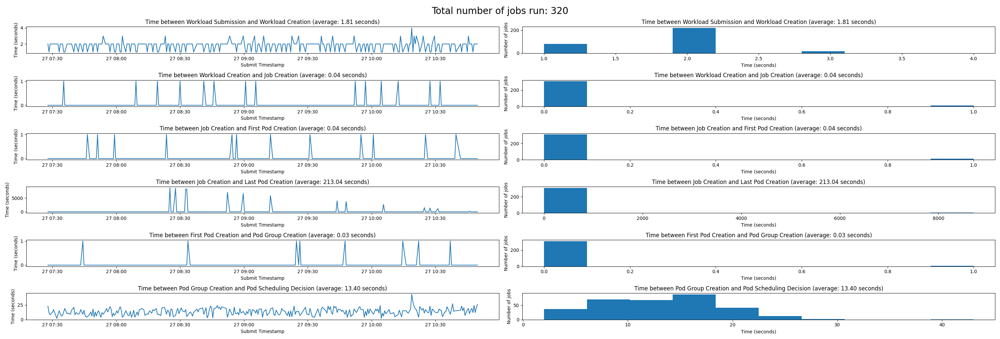

# Run:ai Scale Test Tool


# Introduction
Run:ai scale test tool is a Python framework used to test a runai deployment (cluster and control-plane) at scale, involving a significant number of nodes and GPUs. The Run:ai scale test tool has been used on Kubernetes clusters beyond 1,000 nodes. 

During the test process, workloads are submitted and various time deltas are measured, of key events in the lifecycle of a workload, e.g. from submission to scheduling.
The tests use both Training and Distributed workloads, and allow setting the number of jobs as well as other parameters. 

The tests work in three phases:

1. Job submission.
2. Time sampling and logging.
3. Graph plotting.


## The Fake GPU Operator

To simulate on a cluster using a significant number of nodes, Run:ai has opened sourced an NVIDIA GPU Operator simulator known as a [fake GPU Operator](https://github.com/run-ai/fake-gpu-operator). The two tools can be used in conjunction. 

# Setup

You should set up a Python virtual environment using the `requirements.txt` file. For example:

```
cd ~/venv
python3 -m venv scale-venv
source ~/venv/scale-venv/bin/activate
pip3 install -r /path/to/code/scale-test/requirements.txt
```


# Running the tests

## Job Submitter

`submitter.py`:

The script submits jobs in a loop, allowing to control the number of jobs submitted in each iteration (in parallel) and the delay (sleep time) in-between iterations. The script may take a couple of hours, for example, running 1,000 jobs with 10 seconds delay will take at least 10,000 seconds which is almost 3 hours. Therefore, it is recommended to run it from a machine in the cloud and not locally.

The output of the script is a file called `submitted.json` under the provided output-dir.


```
usage: submitter.py [-h] [--output-dir OUTPUT_DIR] [--workload-type {training,distributed,interactive}] [--num-workloads NUM_WORKLOADS] [--num-processes NUM_PROCESSES] [--num-workers NUM_WORKERS] [--num-gpus NUM_GPUS]
                    [--delay DELAY] [--project PROJECT] [--pvc]

options:
  -h, --help            show this help message and exit
  --output-dir OUTPUT_DIR, -o OUTPUT_DIR
                        Output dir
  --workload-type {training,distributed,interactive}, -t {training,distributed,interactive}
                        Workload type (default: training)
  --num-workloads NUM_WORKLOADS, -n NUM_WORKLOADS
                        Number of workloads to submit
  --num-processes NUM_PROCESSES, -p NUM_PROCESSES
                        Number of parallel processes to use for submission (default: 8)
  --num-workers NUM_WORKERS
                        Number of workers in a distributed workload (default: 1)
  --num-gpus NUM_GPUS, -g NUM_GPUS
                        Number of gpus per pod (default: 1)
  --delay DELAY         Number of seconds to sleep between submission iterations (default: 0.0)
  --project PROJECT     Project to submit to
  --pvc                 Add PVC to the submitted workloads (default: False)
```


## Job Sampler

`sampler.py`:

The script samples various resources (e.g. pods, podgroups) in order to extract time measurements of key events in the lifecycle of the workloads. The script is built such that it can be run multiple times, while `submitter.py` is running. This way, you can check out the test progress without having to wait for it to complete.

The output of the script is a file called `sampled.json` under the provided output-dir. It should be the same directory used for the `submitter.py` script.

```
usage: sampler.py [-h] [--output-dir OUTPUT_DIR] [--workload-type {training,distributed,interactive}] [--project PROJECT]

options:
  -h, --help            show this help message and exit
  --output-dir OUTPUT_DIR, -o OUTPUT_DIR
                        Output dir
  --workload-type {training,distributed,interactive}, -t {training,distributed,interactive}
                        Workload type (default: training)
  --project PROJECT, -p PROJECT
                        Project to sample
```


## Graph Generator

`plotter.py`:

This script takes the output of the previous stages (i.e. the files `submitted.json` and `sampled.json`) and generates graph plots with the time measurements. The times shown in the graphs are deltas, meaning each measurement (in seconds) refers to the delta time between the current event (e.g. pod creation) and the previous one (e.g. job creation).

Times are in seconds, so any delta which is less than 1 second will show as 0. These tests are not intended for millisecond-level profiling.

The output of the script are the following files under the provided output-dir:

* `times.csv` - with all the job info data, for further analysis in Excel.
* `<general/detailed>.png` - with the plot.


```
usage: plotter.py [-h] [--output-dir OUTPUT_DIR] [--plot {general,detailed}] [--skip-errors] [--head HEAD] [--tail TAIL]

options:
  -h, --help            show this help message and exit
  --output-dir OUTPUT_DIR, -o OUTPUT_DIR
                        Output dir
  --plot {general,detailed}
                        Plot type (default: general)
  --skip-errors         Skip workloads with erroneous times, excluding them from the graphs (default: True)
  --head HEAD           Process only this number of workloads from the start
  --tail TAIL           Process only this number of workloads from the end
```

## Reading the report

A report would look like this:



* On the right hand side you can see a distribution of responses as a histogram
* On the left hand side, you can see performance along time.
* The rows represnts steps in the workload creation.

# Configurations

## Settings file

`settings.py`:

This file holds various settings for the tests - mostly ones that are not commonly used and thus are not part of the scripts' command lines options.

For specific details see the documentation in the file itself.

Examples of optional settings:

* Toggling between submitting jobs using `kubectl`, or using Run:ai CLI.
* Controlling the resolution of time measurements (e.g. with or without backend times, with or without detailed scheduling decision times).

## YAML templates

The submitted workloads are based on YAML templates for Run:ai & Kubernetew resources such as `TrainingWorkload` and PVC.

The `submitter.py` script uses these templates, replaces the values given as command line options (e.g. num-gpus, num-workers) and uses the result YAML with kubectl.

__Any spec field that is not implemented in the code can be added directly to the YAML__. Either with or without adding a command line option to control it.

# Sample run commands

2000 training jobs, 5 parallel submits each second, high-level plot

```
# the first command should be run once
submitter.py -t training -n 2000 -p 5 --delay 1 -o out1

# then the following two commands can be run every few minutes,
# whenever we want to have an updated sample
sampler.py -t training -o out1
plotter.py --skip-errors -o out1
```

1000 distributed jobs, 1 submit each 5 seconds, with pvc, detailed plot

```
submitter.py -t distributed -n 1000 --num-workers 7 --pvc -p 1 --delay 5 -o out2

sampler.py -t distributed -o out2
plotter.py --skip-errors --plot detailed -o out2
```

